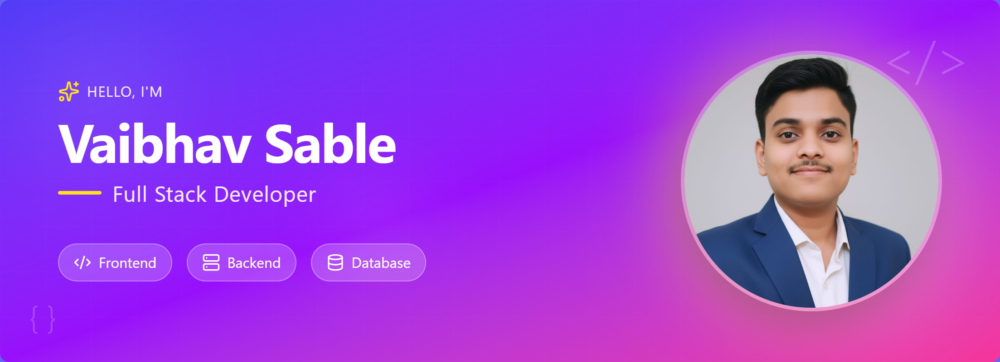

  

<h1 align="center">Hi 👋, I'm Vaibhav Sable!</h1>

<h3 align="center">Full Stack Developer | Java | React.js | Python | Cloud-ready apps on AWS | AI & scalable, efficient code enthusiast 🚀</h3>

<h3 align="left">More About Me:</h3>

- 🌱 I’m currently learning: **Advanced TypeScript, Spring Security with JWT, and AI Chatbot Integration**
- 🔭 I’m currently working on: **Multi-Vendor eCommerce Platform – Full-stack app with Spring Boot, React, and AI chatbot integration; improved page load by 20% and reduced response time by 35%.  Employee Management System – CRUD-based employee portal using React, Spring Boot, and MySQL with tested REST APIs.  AI Chatbot (AgentX – “Friday”) – Custom conversational AI built with AgentX and Google Gemini 2.5 Pro; improved engagement by 30% and reduced latency by 40%.  AI Chatbot (HTML, CSS & JS) – LLM-powered voice chatbot using vanilla JS; enhanced accessibility and reduced response time by 35%.  AI Fitness App (Microservices) – AI-powered fitness platform with Spring Boot microservices, React, Docker, and Kafka; achieved 92% prediction accuracy for workouts.  Personal Portfolio Website – Developed a modern portfolio using Next.js and Tailwind CSS, showcasing projects and blog posts; deployed on Netlify for optimized performance and global accessibility.**
- 💬 Ask me about: **Full Stack Web Development, Java Spring Boot, React.js, REST APIs, and Automation Workflows**
- 📫 How to reach me: [vaibhavsable150@gmail.com](mailto:vaibhavsable150@gmail.com)
- 👨‍💻 **[My Portfolio](https://meek-tarsier-36387c.netlify.app/)**
- 📄 **[My Resume](https://drive.google.com/file/d/1iOuq7scLAK-3hLHbzvyhqhrMlTIE8sJi/view)**

<h3 align="left">Connect with me:</h3>

  

<h3 align="left">Languages and Tools:</h3>

  
  
  
  
  
  
  
  
  
  
  
  
  
  
  
  
  
  
  
  
  
  
  

     

