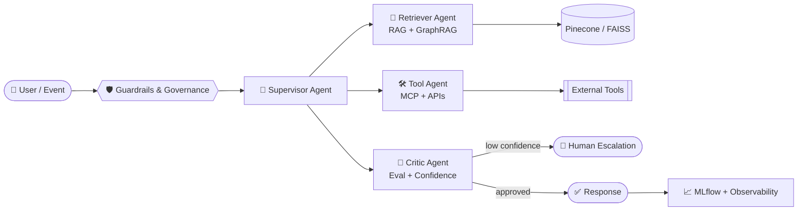

  

  

  
  
  
  

  
  
  
  
  

  <a href="#-tldr-for-recruiters">⚡ TL;DR</a> •
  <a href="#-what-i-build">🧬 Architecture</a> •
  <a href="#-flagship-projects">🏆 AI Projects</a> •
  <a href="#-backend-microservices--full-stack-java">☕ Java</a> •
  <a href="#️-tech-arsenal">🛠️ Stack</a> •
  <a href="#-experience">💼 Experience</a> •
  <a href="#-lets-build-something">🤝 Contact</a>

---

## ⚡ TL;DR for Recruiters

| | |
|---|---|
| 🎯 **Role** | AI Engineer · GenAI Engineer · Agentic AI Developer · LLM Engineer |
| 🧠 **Core strength** | Multi-agent systems, RAG pipelines, MCP integrations, AI governance & observability |
| 🏗️ **Ships** | FastAPI backends · vector search · LLM orchestration · Dockerized, MLflow-tracked deployments |
| 💼 **Experience** | Data Science Intern + Java Backend Intern (20+ REST APIs, JWT/RBAC, Docker) |
| 📍 **Based in** | Pune, India — open to remote / hybrid / relocation |
| ⏱️ **Availability** | **Immediate joiner** |
| 📬 **Reach me** | [vaibhavsable150@gmail.com](mailto:vaibhavsable150@gmail.com) · [LinkedIn](https://www.linkedin.com/in/vaibhavsable-ai-engineer/) |

---

## 🧬 What I Build

```mermaid
flowchart LR
    U([👤 User / Event]) --> G{{🛡️ Guardrails & Governance}}
    G --> S[🧭 Supervisor Agent]
    S --> A1[🔎 Retriever Agent<br/>RAG + GraphRAG]
    S --> A2[🛠️ Tool Agent<br/>MCP + APIs]
    S --> A3[🧪 Critic Agent<br/>Eval + Confidence]
    A1 --> V[(Pinecone / FAISS)]
    A2 --> X[[External Tools]]
    A3 -->|low confidence| H([🙋 Human Escalation])
    A3 -->|approved| R([✅ Response])
    R --> O[📈 MLflow + Observability]
```

> Every system I build follows one idea: **agents that retrieve, reason, act — and know when to escalate.**

---

## 🔥 Currently Building (2026)

| 🚧 Project | 💡 Focus |
|---|---|
| [**Cortex-Enterprise-AI-Platform**](https://github.com/Vaibhavsable451/Cortex-Enterprise-AI-Platform) | Enterprise AI platform |
| [**AegisAI-Enterprise-AI-Governance-Agent**](https://github.com/Vaibhavsable451/AegisAI-Enterprise-AI-Governance-Agent) | Governance-first AI agent (TypeScript) |
| [**AI-Customer-Support-Command-Center**](https://github.com/Vaibhavsable451/AI-Customer-Support-Command-Center) | Multi-agent support with confidence-based escalation |
| [**NeuraGuard**](https://github.com/Vaibhavsable451/NeuraGuard-Enterprise-Agentic-AI-Control-Governance-Platform) | Agentic AI control & governance |
| [**ML-Sentinel**](https://github.com/Vaibhavsable451/ML-Sentinel-Autonomous-ML-Intelligence-Platform) | Autonomous ML intelligence |

🌱 **Exploring:** MCP · multi-agent orchestration · agent evals · AI governance · GraphRAG

---

## 🏆 Flagship Projects

> 🤖 **AI projects first** — agentic systems, RAG, governance and automation. Java / backend work is listed after.

### 🛡️ Enterprise AI Governance & Observability
| Project | What it is |
|---|---|
| [**AegisAI – Governance Agentic RAG Platform**](https://github.com/Vaibhavsable451/AegisAI-Enterprise-AI-Governance-Agentic-RAG-Platform) | Enterprise AI governance with agentic RAG |
| [**AegisAI – Governance Agent**](https://github.com/Vaibhavsable451/AegisAI-Enterprise-AI-Governance-Agent) | Governance agent with a TypeScript front end |
| [**NeuraGuard**](https://github.com/Vaibhavsable451/NeuraGuard-Enterprise-Agentic-AI-Control-Governance-Platform) | Control and governance layer for agentic AI |
| [**ML Governance & AI Observability Platform**](https://github.com/Vaibhavsable451/-ML-Governance-AI-Observability-Platform) | Governance and observability for ML systems |
| [**ML-Sentinel**](https://github.com/Vaibhavsable451/ML-Sentinel-Autonomous-ML-Intelligence-Platform) | Autonomous ML intelligence platform |
| [**NeuroForge AI**](https://github.com/Vaibhavsable451/-NeuroForge-AI-Adaptive-Multimodal-Agent-Intelligence-Platform) | Adaptive multimodal agent intelligence platform |

### 🧠 RAG · GraphRAG · MCP
| Project | Stack |
|---|---|
| [**RAG-Assistant – Enterprise RAG with LangChain + MCP**](https://github.com/Vaibhavsable451/RAG-Assistant-Enterprise-RAG-with-LangChain-MCP) | LangChain, MCP, RAG |
| [**GraphRAG Agentic Multilingual RAG**](https://github.com/Vaibhavsable451/graphrag-agentic-multilingual-rag) | GraphRAG, agents, multilingual |
| [**Q&A AI Agent with RAG (n8n)**](https://github.com/Vaibhavsable451/Q-A-AI-Agent-with-RAG-using-n8n-) | n8n, RAG, Pinecone |
| [**AI Data Science LLM Studio**](https://github.com/Vaibhavsable451/AI-Data-Science-LLM-Studio) | LLMs, Jupyter |

### 🤖 Multi-Agent Systems
| Project | Stack | Highlights |
|---|---|---|
| [**AI-Customer-Support-Command-Center**](https://github.com/Vaibhavsable451/AI-Customer-Support-Command-Center) | LangGraph, RAG, Pinecone, FastAPI, MLflow, Docker, K8s | Confidence-based escalation |
| [**TalentFlow AI**](https://github.com/Vaibhavsable451/TalentFlow-AI-Multi-Agent-Recruitment-Automation-System) | Multi-agent | Recruitment automation |
| [**ResumeForgeAI**](https://github.com/Vaibhavsable451/ResumeForgeAI-Multi-Agent-ATS-Resume-Builder-) | LangGraph, Pinecone, Groq, FastAPI | Analyzes JDs + GitHub profiles |
| [**Agentic ATS Resume Generator**](https://github.com/Vaibhavsable451/Agentic-ATS-Resume-Generator) | Python, LangGraph, Pinecone, Groq | ATS scoring, semantic + keyword matching |
| [**Resume Intelligence ATS Optimizer**](https://github.com/Vaibhavsable451/Resume-Intelligence-ATS-Optimizer) | JavaScript | ATS optimization |
| [**Multi-Agent AI Research System**](https://github.com/Vaibhavsable451/Multi-Agent-AI-Research-System) | LangChain, Groq, Streamlit | Search → Reader → Writer → Critic |
| [**multi_agent_sales_support**](https://github.com/Vaibhavsable451/multi_agent_sales_support) | n8n, Groq | Supervisor routing — [Live Demo](https://agentfd.netlify.app) |
| [**Cricket Multi-Agent Factory**](https://github.com/Vaibhavsable451/Cricket-Multi-Agent-Factory-Supervisor-6-Agents---Groq-v2) | n8n, Groq, SerpAPI | 6 specialist agents |
| [**AI Sales Intelligence Agent**](https://github.com/Vaibhavsable451/AI-Sales-Intelligence-Agent) | n8n, Groq, SerpAPI | Website analysis + pain-point detection |
| [**YouTube Summarizer Multi-Agent**](https://github.com/Vaibhavsable451/Agentic-AI-YouTube-Summarizer-Multi-Agent-System-) | LangChain, Groq | 4-agent pipeline |

### ⚙️ Automation & AI Apps
| Project | Stack |
|---|---|
| [**ai-content-repurpose-agent**](https://github.com/Vaibhavsable451/ai-content-repurpose-agent) | Python |
| [**AI Cold Email Outreach & Follow-Up**](https://github.com/Vaibhavsable451/AI-Cold-Email-Outreach-Follow-Up-Automation-n8n) | n8n |
| [**company-news-meeting-automation**](https://github.com/Vaibhavsable451/company-news-meeting-automation) | n8n |
| [**FinPassbookAI**](https://github.com/Vaibhavsable451/FinPassbookAI) | HTML, AI |
| [**Ai-Code-Editor**](https://github.com/Vaibhavsable451/Ai-Code-Editor) | JavaScript |
| [**Ai Personal Assistant JARVIS**](https://github.com/Vaibhavsable451/Ai-Peronal-Assitant-JArvis) | HTML, JS (voice) |
| [**ecommerce-website-with-n8n-ai-chatbot**](https://github.com/Vaibhavsable451/ecommerce-website-with-n8n-ai-chatbot) | HTML, n8n |

### 🧰 More AI Tools
| Project | Stack |
|---|---|
| [**Job-Finder-AI-Agent**](https://github.com/Vaibhavsable451/Job-Finder-AI-Agent) | Python, Groq |
| [**Job-Mail-AI-Tracker**](https://github.com/Vaibhavsable451/Job-Mail-AI-Tracker) | Python |
| [**Resume-Anlayzer**](https://github.com/Vaibhavsable451/Resume-Anlayzer) | Python |
| [**Advanced Real-Time AI Personal Assistant**](https://github.com/Vaibhavsable451/Advanced-Real-Time-AI-Personal-Assistant) | Python |
| [**ai-house-price-prediction**](https://github.com/Vaibhavsable451/ai-house-price-prediction) | Jupyter, ML |
| [**3D Portfolio Website**](https://github.com/Vaibhavsable451/3d-Portfolio-Website) | HTML, Three.js |

### ☕ Backend, Microservices & Full-Stack (Java)
| Project | Stack |
|---|---|
| [**AI-Powered Fitness App (Spring Boot Microservices)**](https://github.com/Vaibhavsable451/AI-Powered-Fitness-App-With-Spring-Boot-Microservices) | Java, Spring Boot, microservices, AI |
| [**Employee-Management-System**](https://github.com/Vaibhavsable451/Employee-Management-System) | Java, Spring Boot, MySQL |
| [**MazeBank**](https://github.com/Vaibhavsable451/MazeBank) | Java |
| [**JPMorgan Forage Simulation**](https://github.com/Vaibhavsable451/jpmorgan-forage-simulation) | Java |
| [**Spring AI – Generative AI App**](https://github.com/Vaibhavsable451/Spring-AI-Build-Generative-AI-application-) | Java, Spring AI |
| [**Tech Release Email Agent**](https://github.com/Vaibhavsable451/Tech-Release-Email-Agent-Java-React-Groq-AI-n8n-) | Java, React, Groq, n8n |
| [**Ecommerce_multivendor**](https://github.com/Vaibhavsable451/Ecommerce_multivendor) | TypeScript, React |

📌 **[Explore all 56 repositories →](https://github.com/Vaibhavsable451?tab=repositories)**

---

## 🛠️ Tech Arsenal

---

## 💼 Experience

| Role | Company | Period | Impact |
|---|---|---|---|
| **Data Science Intern** | Internship Studio | Jun 2025 – Dec 2025 | ETL pipelines (**+25% efficiency**), automated reporting, ML-driven stakeholder insights |
| **Java Backend Developer Intern** | ProfoundEdutech Pvt. Ltd. | Feb 2025 – Sep 2025 | **20+ REST APIs**, JWT/RBAC security, Dockerized deployment, AI chatbot integration (**−35% response time**) |

---

## 📜 Certifications & Achievements

🎓 Introduction to Prompt Engineering · 🎓 AI Agents for Beginners · 🎓 Leading Through AI Agent Disruption · 🎓 Professional Networking for Career Growth · 🎓 SQL (Advanced) — HackerRank · 🏆 50+ DSA Problems Solved

---

## 📊 GitHub Analytics

  
  

  

  

  

  

---

## 🤝 Let's Build Something

  <b>Hiring for an AI / GenAI / Agentic AI role? Let's talk.</b>  
  
  

<i>⚡ Building production-ready Agentic AI systems, one agent at a time.</i>

  

