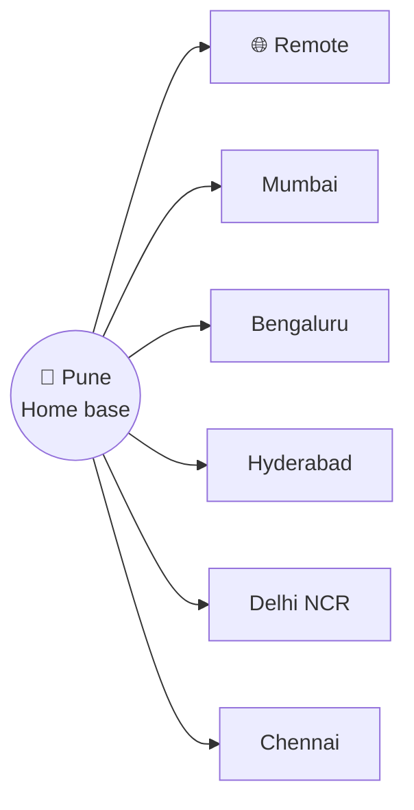
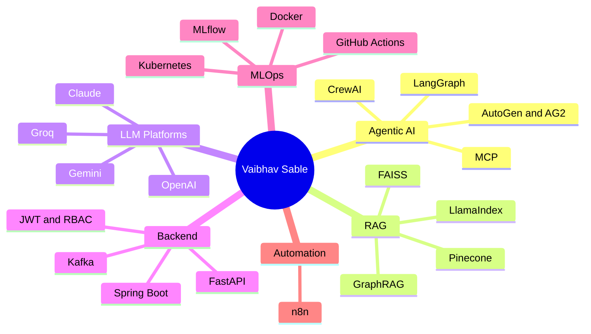
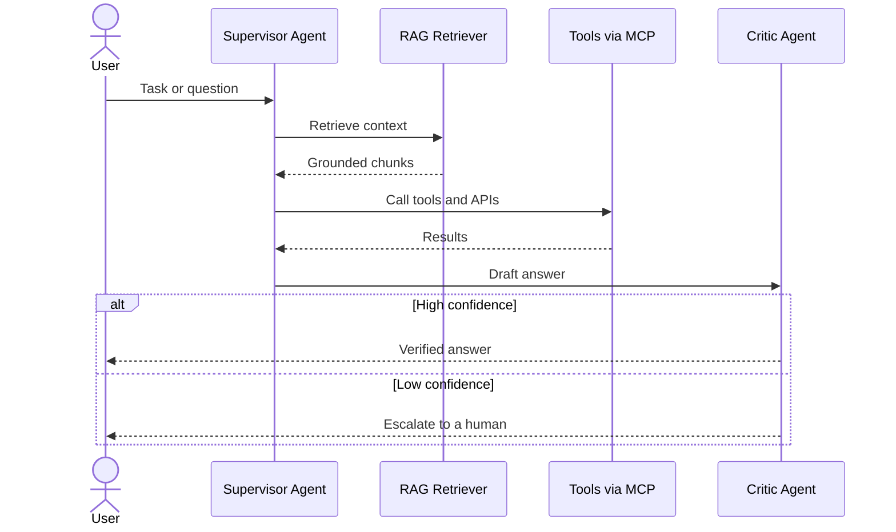
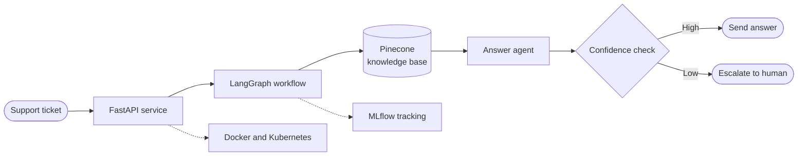
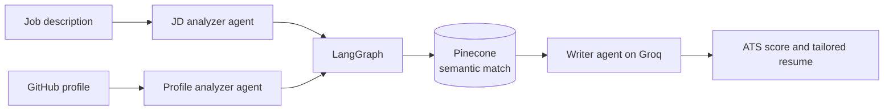
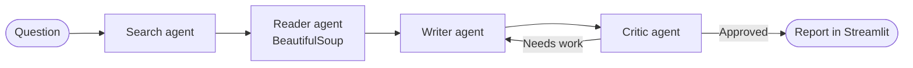
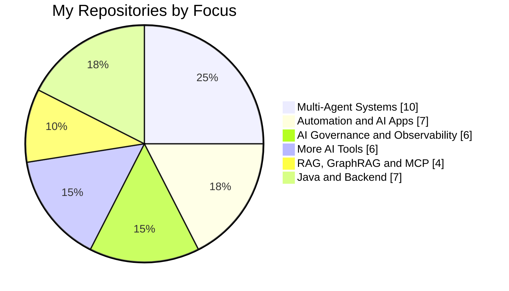
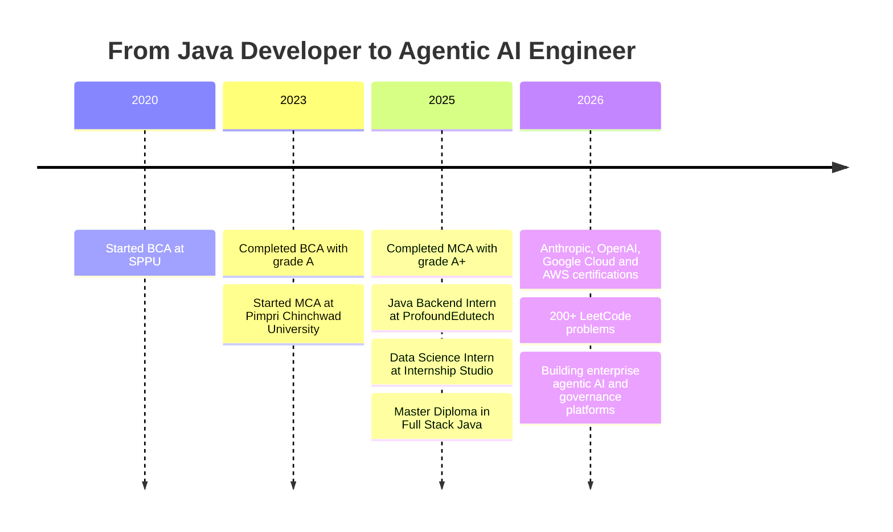
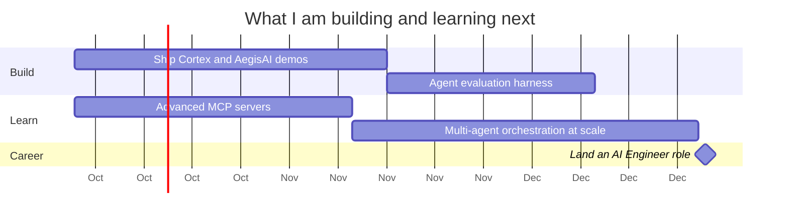

  

  
  
  
  
  

  
  
  
  
  

  <a href="#-tldr-for-recruiters">⚡ TL;DR</a> •
  <a href="#-what-i-build">🧬 Architecture</a> •
  <a href="#-featured-repositories-live-cards">📌 Featured</a> •
  <a href="#-flagship-projects">🏆 AI Projects</a> •
  <a href="#-backend-microservices--full-stack-java">☕ Java</a> •
  <a href="#️-tech-arsenal">🛠️ Stack</a> •
  <a href="#-experience">💼 Experience</a> •
  <a href="#-education">🎓 Education</a> •
  <a href="#-certifications">📜 Certs</a> •
  <a href="#-lets-build-something">🤝 Contact</a>

## 🎤 30-Second Pitch

> I am an **AI Engineer** who builds multi-agent systems that retrieve, reason, act, and know when to hand off to a human. My projects combine **LangGraph, RAG, MCP and FastAPI** with governance and observability, and I ship them with **Docker, Kubernetes and MLflow**. I come from a Java microservices background, so I treat reliability and security as part of the design.

  
  

<b>📑 Full Table of Contents</b>

1. [TL;DR for Recruiters](#-tldr-for-recruiters)
2. [Impact at a Glance](#-impact-at-a-glance) · [Why Hire Me](#-why-hire-me) · [Now](#-now)
3. [Live Demos](#-live-demos) · [Where I Can Work](#-where-i-can-work)
4. [What I Build](#-what-i-build) · [Skills Mind Map](#-skills-mind-map)
5. [How My Agents Work](#-how-one-of-my-agents-handles-a-request) · [Design Decisions](#-how-i-design-agents) · [Toolbox](#-my-toolbox-by-use-case)
6. [Featured Repositories](#-featured-repositories-live-cards) · [Architecture Deep-Dives](#-architecture-deep-dives)
7. [Flagship Projects](#-flagship-projects)
8. [Tech Arsenal](#️-tech-arsenal) · [Experience](#-experience) · [Education](#-education) · [Journey](#️-my-journey)
9. [Competitive Programming](#-competitive-programming) · [Certifications](#-certifications)
10. [GitHub Analytics](#-github-analytics) · [Roadmap](#️-h2-2026-roadmap) · [Ask Me About](#-ask-me-about) · [Contact](#-lets-build-something)

## ⚡ TL;DR for Recruiters

| | |
|---|---|
| 🎯 **Role** | **AI Engineer** |
| 🧠 **Core strength** | Multi-agent systems, RAG pipelines, MCP integrations, AI governance & observability |
| 🏗️ **Ships** | FastAPI backends · vector search · LLM orchestration · Dockerized, MLflow-tracked deployments |
| 💼 **Experience** | Data Science Intern + Java Backend Intern (20+ REST APIs, JWT/RBAC, Docker) |
| 🎓 **Education** | MCA (A+) — Pimpri Chinchwad University · BCA (A) — SPPU |
| 📜 **Credentials** | **100+** certifications — Anthropic (Claude API, MCP, Claude Code), OpenAI Academy, Google Cloud, AWS, Hugging Face, LangChain |
| 🧩 **Problem solving** | **200+** LeetCode · 41+ CodeChef · Codeforces |
| 📍 **Based in** | Pune, India |
| 🌏 **Open to work in** | **Remote** · Pune · Mumbai · Bengaluru · Hyderabad · Delhi NCR · Chennai |
| ⏱️ **Availability** | **Immediate joiner** |
| 📬 **Reach me** | [vaibhavsable150@gmail.com](mailto:vaibhavsable150@gmail.com) · [LinkedIn](https://www.linkedin.com/in/vaibhavsable-ai-engineer/) |

## 🍱 Impact at a Glance

<table align="center">
<tr>
<td align="center" width="33%"><h1>56</h1><b>GitHub repositories</b> agents · RAG · governance · backend</td>
<td align="center" width="33%"><h1>100+</h1><b>Certifications</b> 13 from Anthropic alone</td>
<td align="center" width="33%"><h1>200+</h1><b>LeetCode problems</b> + CodeChef and Codeforces</td>
</tr>
<tr>
<td align="center"><h1>20+</h1><b>Secured REST APIs</b> JWT · RBAC · Docker</td>
<td align="center"><h1>+25%</h1><b>ETL efficiency</b> Data Science internship</td>
<td align="center"><h1>−35%</h1><b>Response time</b> AI chatbot integration</td>
</tr>
</table>

## 🎯 Why Hire Me

| | |
|---|---|
| 🧠 **I build the whole agent stack** | Supervisor agents, RAG retrieval, MCP tools, a critic, and a human-escalation path. |
| 🛡️ **I think about governance** | AegisAI, NeuraGuard and ML-Sentinel focus on control, observability and safe deployment. |
| ⚙️ **I ship it properly** | FastAPI, Docker, Kubernetes, MLflow and CI/CD, backed by real Java microservices experience. |
| 📚 **I keep learning fast** | 100+ certifications in 2025–26, with the newest on Claude, MCP, OpenAI and Google Cloud. |

## 🟢 Now

| | |
|---|---|
| 🔨 **Building** | Cortex Enterprise AI Platform · AegisAI Governance Agent · AI Customer Support Command Center |
| 📖 **Learning** | Advanced MCP servers · multi-agent orchestration · agent evaluation |
| 🎯 **Looking for** | AI Engineer role — immediate joiner |
| 💬 **Ask me about** | RAG, LangGraph, multi-agent systems, vector databases, MLOps |

## 🌐 Live Demos

| Demo | Link |
|---|---|
| 💼 **Portfolio** | [portfolio-wheat-six-apdmu7v0c7.vercel.app](https://portfolio-wheat-six-apdmu7v0c7.vercel.app/) |
| 🤖 **Multi-Agent Sales Support** (supervisor routing) | [agentfd.netlify.app](https://agentfd.netlify.app) |
| 📄 **Resume** | [Open on Google Drive](https://drive.google.com/file/d/1lDAZOMSPLvNZG1pB7ps124SSN1N-UjTs/view?usp=sharing) |

## 🗺️ Where I Can Work

```mermaid
flowchart LR
    P(("📍 Pune<br/>Home base")) --> R["🌐 Remote"]
    P --> M["Mumbai"]
    P --> B["Bengaluru"]
    P --> H["Hyderabad"]
    P --> D["Delhi NCR"]
    P --> C["Chennai"]
```

## 🧬 What I Build

```mermaid
flowchart LR
    U([👤 User / Event]) --> G{{🛡️ Guardrails & Governance}}
    G --> S[🧭 Supervisor Agent]
    S --> A1[🔎 Retriever Agent<br/>RAG + GraphRAG]
    S --> A2[🛠️ Tool Agent<br/>MCP + APIs]
    S --> A3[🧪 Critic Agent<br/>Eval + Confidence]
    A1 --> V[(Pinecone / FAISS)]
    A2 --> X[[External Tools]]
    A3 -->|low confidence| H([🙋 Human Escalation])
    A3 -->|approved| R([✅ Response])
    R --> O[📈 MLflow + Observability]
```

> Every system I build follows one idea: **agents that retrieve, reason, act — and know when to escalate.**

## 🧠 Skills Mind Map

```mermaid
mindmap
  root((Vaibhav Sable))
    Agentic AI
      LangGraph
      CrewAI
      AutoGen and AG2
      MCP
    RAG
      Pinecone
      FAISS
      GraphRAG
      LlamaIndex
    LLM Platforms
      Claude
      OpenAI
      Gemini
      Groq
    Backend
      FastAPI
      Spring Boot
      Kafka
      JWT and RBAC
    MLOps
      MLflow
      Docker
      Kubernetes
      GitHub Actions
    Automation
      n8n
```

## 🔄 How One of My Agents Handles a Request

```mermaid
sequenceDiagram
    actor U as User
    participant S as Supervisor Agent
    participant R as RAG Retriever
    participant T as Tools via MCP
    participant C as Critic Agent
    U->>S: Task or question
    S->>R: Retrieve context
    R-->>S: Grounded chunks
    S->>T: Call tools and APIs
    T-->>S: Results
    S->>C: Draft answer
    alt High confidence
        C-->>U: Verified answer
    else Low confidence
        C-->>U: Escalate to a human
    end
```

## 🧪 How I Design Agents

| Principle | What it means in my projects |
|---|---|
| **Ground every answer** | Retrieve from a vector store before generating, so answers trace back to sources. |
| **Know when to stop** | A critic scores confidence, and low-confidence cases escalate to a human. |
| **Split the work** | A supervisor routes tasks to small specialist agents instead of one giant prompt. |
| **Make it observable** | Runs are tracked with MLflow so quality and cost can be compared over time. |
| **Secure by default** | JWT and role-based access control, learned from my Java microservices work. |

## 🧰 My Toolbox by Use Case

| When I need to... | I reach for |
|---|---|
| Orchestrate stateful agent flows | LangGraph, LangChain |
| Run role-based agent teams | CrewAI, AutoGen / AG2 |
| Connect agents to tools | Model Context Protocol (MCP) |
| Retrieve knowledge | Pinecone, FAISS, LlamaIndex, GraphRAG |
| Call fast or frontier LLMs | Groq, Claude, OpenAI, Gemini |
| Serve an API | FastAPI, Spring Boot |
| Automate without heavy code | n8n |
| Track and ship | MLflow, Docker, Kubernetes, GitHub Actions |

## 🔥 Currently Building (2026)

| 🚧 Project | 💡 Focus |
|---|---|
| [**Cortex-Enterprise-AI-Platform**](https://github.com/Vaibhavsable451/Cortex-Enterprise-AI-Platform) | Enterprise AI platform |
| [**AegisAI-Enterprise-AI-Governance-Agent**](https://github.com/Vaibhavsable451/AegisAI-Enterprise-AI-Governance-Agent) | Governance-first AI agent (TypeScript) |
| [**AI-Customer-Support-Command-Center**](https://github.com/Vaibhavsable451/AI-Customer-Support-Command-Center) | Multi-agent support with confidence-based escalation |
| [**NeuraGuard**](https://github.com/Vaibhavsable451/NeuraGuard-Enterprise-Agentic-AI-Control-Governance-Platform) | Agentic AI control & governance |
| [**ML-Sentinel**](https://github.com/Vaibhavsable451/ML-Sentinel-Autonomous-ML-Intelligence-Platform) | Autonomous ML intelligence |

🌱 **Exploring:** MCP · multi-agent orchestration · agent evals · AI governance · GraphRAG

## 📌 Featured Repositories (Live Cards)

  
  
  
  
  
  

  
  
  

## 🏗️ Architecture Deep-Dives

<b>🛟 AI Customer Support Command Center</b> — confidence-based escalation

```mermaid
flowchart LR
    T([Support ticket]) --> API[FastAPI service]
    API --> G[LangGraph workflow]
    G --> RAG[(Pinecone<br/>knowledge base)]
    RAG --> A[Answer agent]
    A --> C{Confidence check}
    C -->|High| OUT([Send answer])
    C -->|Low| H([Escalate to human])
    G -.-> ML[MLflow tracking]
    API -.-> D[Docker and Kubernetes]
```

<b>📄 ResumeForgeAI</b> — multi-agent ATS resume builder

```mermaid
flowchart LR
    JD[Job description] --> A1[JD analyzer agent]
    GH[GitHub profile] --> A2[Profile analyzer agent]
    A1 --> G[LangGraph]
    A2 --> G
    G --> V[(Pinecone<br/>semantic match)]
    V --> W[Writer agent on Groq]
    W --> S[ATS score and tailored resume]
```

<b>🔎 Multi-Agent AI Research System</b> — four-agent pipeline

```mermaid
flowchart LR
    Q([Question]) --> S[Search agent]
    S --> R[Reader agent<br/>BeautifulSoup]
    R --> W[Writer agent]
    W --> C[Critic agent]
    C -->|Needs work| W
    C -->|Approved| O([Report in Streamlit])
```

> Diagrams are based on each repo's stack and description. Adjust a box if your implementation differs.

## 🏆 Flagship Projects

> 🤖 **AI projects first** — agentic systems, RAG, governance and automation. Java / backend work is listed after.

```mermaid
pie showData title My Repositories by Focus
    "Multi-Agent Systems" : 10
    "Automation and AI Apps" : 7
    "AI Governance and Observability" : 6
    "More AI Tools" : 6
    "RAG, GraphRAG and MCP" : 4
    "Java and Backend" : 7
```

### 🛡️ Enterprise AI Governance & Observability
| Project | What it is |
|---|---|
| [**AegisAI – Governance Agentic RAG Platform**](https://github.com/Vaibhavsable451/AegisAI-Enterprise-AI-Governance-Agentic-RAG-Platform) | Enterprise AI governance with agentic RAG |
| [**AegisAI – Governance Agent**](https://github.com/Vaibhavsable451/AegisAI-Enterprise-AI-Governance-Agent) | Governance agent with a TypeScript front end |
| [**NeuraGuard**](https://github.com/Vaibhavsable451/NeuraGuard-Enterprise-Agentic-AI-Control-Governance-Platform) | Control and governance layer for agentic AI |
| [**ML Governance & AI Observability Platform**](https://github.com/Vaibhavsable451/-ML-Governance-AI-Observability-Platform) | Governance and observability for ML systems |
| [**ML-Sentinel**](https://github.com/Vaibhavsable451/ML-Sentinel-Autonomous-ML-Intelligence-Platform) | Autonomous ML intelligence platform |
| [**NeuroForge AI**](https://github.com/Vaibhavsable451/-NeuroForge-AI-Adaptive-Multimodal-Agent-Intelligence-Platform) | Adaptive multimodal agent intelligence platform |

### 🧠 RAG · GraphRAG · MCP
| Project | Stack |
|---|---|
| [**RAG-Assistant – Enterprise RAG with LangChain + MCP**](https://github.com/Vaibhavsable451/RAG-Assistant-Enterprise-RAG-with-LangChain-MCP) | LangChain, MCP, RAG |
| [**GraphRAG Agentic Multilingual RAG**](https://github.com/Vaibhavsable451/graphrag-agentic-multilingual-rag) | GraphRAG, agents, multilingual |
| [**Q&A AI Agent with RAG (n8n)**](https://github.com/Vaibhavsable451/Q-A-AI-Agent-with-RAG-using-n8n-) | n8n, RAG, Pinecone |
| [**AI Data Science LLM Studio**](https://github.com/Vaibhavsable451/AI-Data-Science-LLM-Studio) | LLMs, Jupyter |

### 🤖 Multi-Agent Systems
| Project | Stack | Highlights |
|---|---|---|
| [**AI-Customer-Support-Command-Center**](https://github.com/Vaibhavsable451/AI-Customer-Support-Command-Center) | LangGraph, RAG, Pinecone, FastAPI, MLflow, Docker, K8s | Confidence-based escalation |
| [**TalentFlow AI**](https://github.com/Vaibhavsable451/TalentFlow-AI-Multi-Agent-Recruitment-Automation-System) | Multi-agent | Recruitment automation |
| [**ResumeForgeAI**](https://github.com/Vaibhavsable451/ResumeForgeAI-Multi-Agent-ATS-Resume-Builder-) | LangGraph, Pinecone, Groq, FastAPI | Analyzes JDs + GitHub profiles |
| [**Agentic ATS Resume Generator**](https://github.com/Vaibhavsable451/Agentic-ATS-Resume-Generator) | Python, LangGraph, Pinecone, Groq | ATS scoring, semantic + keyword matching |
| [**Resume Intelligence ATS Optimizer**](https://github.com/Vaibhavsable451/Resume-Intelligence-ATS-Optimizer) | JavaScript | ATS optimization |
| [**Multi-Agent AI Research System**](https://github.com/Vaibhavsable451/Multi-Agent-AI-Research-System) | LangChain, Groq, Streamlit | Search → Reader → Writer → Critic |
| [**multi_agent_sales_support**](https://github.com/Vaibhavsable451/multi_agent_sales_support) | n8n, Groq | Supervisor routing — [Live Demo](https://agentfd.netlify.app) |
| [**Cricket Multi-Agent Factory**](https://github.com/Vaibhavsable451/Cricket-Multi-Agent-Factory-Supervisor-6-Agents---Groq-v2) | n8n, Groq, SerpAPI | 6 specialist agents |
| [**AI Sales Intelligence Agent**](https://github.com/Vaibhavsable451/AI-Sales-Intelligence-Agent) | n8n, Groq, SerpAPI | Website analysis + pain-point detection |
| [**YouTube Summarizer Multi-Agent**](https://github.com/Vaibhavsable451/Agentic-AI-YouTube-Summarizer-Multi-Agent-System-) | LangChain, Groq | 4-agent pipeline |

### ⚙️ Automation & AI Apps
| Project | Stack |
|---|---|
| [**ai-content-repurpose-agent**](https://github.com/Vaibhavsable451/ai-content-repurpose-agent) | Python |
| [**AI Cold Email Outreach & Follow-Up**](https://github.com/Vaibhavsable451/AI-Cold-Email-Outreach-Follow-Up-Automation-n8n) | n8n |
| [**company-news-meeting-automation**](https://github.com/Vaibhavsable451/company-news-meeting-automation) | n8n |
| [**FinPassbookAI**](https://github.com/Vaibhavsable451/FinPassbookAI) | HTML, AI |
| [**Ai-Code-Editor**](https://github.com/Vaibhavsable451/Ai-Code-Editor) | JavaScript |
| [**Ai Personal Assistant JARVIS**](https://github.com/Vaibhavsable451/Ai-Peronal-Assitant-JArvis) | HTML, JS (voice) |
| [**ecommerce-website-with-n8n-ai-chatbot**](https://github.com/Vaibhavsable451/ecommerce-website-with-n8n-ai-chatbot) | HTML, n8n |

### 🧰 More AI Tools
| Project | Stack |
|---|---|
| [**Job-Finder-AI-Agent**](https://github.com/Vaibhavsable451/Job-Finder-AI-Agent) | Python, Groq |
| [**Job-Mail-AI-Tracker**](https://github.com/Vaibhavsable451/Job-Mail-AI-Tracker) | Python |
| [**Resume-Anlayzer**](https://github.com/Vaibhavsable451/Resume-Anlayzer) | Python |
| [**Advanced Real-Time AI Personal Assistant**](https://github.com/Vaibhavsable451/Advanced-Real-Time-AI-Personal-Assistant) | Python |
| [**ai-house-price-prediction**](https://github.com/Vaibhavsable451/ai-house-price-prediction) | Jupyter, ML |
| [**3D Portfolio Website**](https://github.com/Vaibhavsable451/3d-Portfolio-Website) | HTML, Three.js |

### ☕ Backend, Microservices & Full-Stack (Java)
| Project | Stack |
|---|---|
| [**AI-Powered Fitness App (Spring Boot Microservices)**](https://github.com/Vaibhavsable451/AI-Powered-Fitness-App-With-Spring-Boot-Microservices) | Java, Spring Boot, microservices, AI |
| [**Employee-Management-System**](https://github.com/Vaibhavsable451/Employee-Management-System) | Java, Spring Boot, MySQL |
| [**MazeBank**](https://github.com/Vaibhavsable451/MazeBank) | Java |
| [**JPMorgan Forage Simulation**](https://github.com/Vaibhavsable451/jpmorgan-forage-simulation) | Java |
| [**Spring AI – Generative AI App**](https://github.com/Vaibhavsable451/Spring-AI-Build-Generative-AI-application-) | Java, Spring AI |
| [**Tech Release Email Agent**](https://github.com/Vaibhavsable451/Tech-Release-Email-Agent-Java-React-Groq-AI-n8n-) | Java, React, Groq, n8n |
| [**Ecommerce_multivendor**](https://github.com/Vaibhavsable451/Ecommerce_multivendor) | TypeScript, React |

📌 **[Explore all 56 repositories →](https://github.com/Vaibhavsable451?tab=repositories)**

## 🛠️ Tech Arsenal

## 💼 Experience

| Role | Company | Period | Impact |
|---|---|---|---|
| **Data Science Intern** | Internship Studio | Jun 2025 – Dec 2025 | ETL pipelines (**+25% efficiency**), automated reporting, ML-driven stakeholder insights |
| **Java Backend Developer Intern** | ProfoundEdutech Pvt. Ltd. | Feb 2025 – Sep 2025 | **20+ REST APIs**, JWT/RBAC security, Dockerized deployment, AI chatbot integration (**−35% response time**) |

## 🎓 Education

| Degree | Institution | Period | Grade |
|---|---|---|---|
| **MCA — Computer Science** | Pimpri Chinchwad University, Pune | Aug 2023 – May 2025 | **A+** |
| **BCA — Computer Applications** | Savitribai Phule Pune University | Jan 2020 – May 2023 | **A** |

**MCA final-year project:** a production-style **microservices e-commerce backend** with Spring Boot, Apache Kafka, Docker and MySQL — Eureka service discovery, API Gateway, JWT authentication, event-driven architecture, 20+ secured REST APIs with role-based access control.
**Coursework:** Distributed Systems · DBMS · Cloud Computing · Software Engineering · DSA · Object-Oriented Design

## 🗺️ My Journey

```mermaid
timeline
    title From Java Developer to Agentic AI Engineer
    2020 : Started BCA at SPPU
    2023 : Completed BCA with grade A : Started MCA at Pimpri Chinchwad University
    2025 : Completed MCA with grade A+ : Java Backend Intern at ProfoundEdutech : Data Science Intern at Internship Studio : Master Diploma in Full Stack Java
    2026 : Anthropic, OpenAI, Google Cloud and AWS certifications : 200+ LeetCode problems : Building enterprise agentic AI and governance platforms
```

## 🧩 Competitive Programming

  
  
  

## 📜 Certifications

  
  
  
  
  

### ⭐ Highlight Credentials (AI Engineering)

| Issuer | Credential | Issued |
|---|---|---|
| **Anthropic** | Claude Academy: Claude with Amazon Bedrock | Sep 2026 |
| **OpenAI Academy** | AI Leadership · Agents and Workflows · Applied AI Foundations · AI Foundations | Aug–Sep 2026 |
| **Google Cloud** | Gen AI Academy APAC Edition (Cohort 2) — MCP | Jul 2026 |
| **LangChain Playground** | Deep Agents | Mar 2026 |
| **Hugging Face** | AI Agents Fundamentals (smolagents) | Mar 2026 |
| **Activeloop** | Gen AI 360 — RAG with LangChain & LlamaIndex | Mar 2026 |
| **AWS** | Introduction to Agentic AI on AWS · Foundations of Prompt Engineering | Mar 2026 |
| **Analytics Vidhya** | CrewAI, AutoGen, AG2, Deep Research Agent, Data Analyst Agent, Knowledge Bases & Memory, Agentic AI with Bedrock | Mar 2026 |
| **LinkedIn** | RAG Fine-Tuning · Introduction to Spring AI · MCP Advanced Topics | Apr 2026 |
| **LinkedIn Learning** | Claude Agent SDK · OpenAI AgentKit · Reasoning Models for AI Agents · GPT-5 Agents · MCP for Beginners (Microsoft) · Cursor 2 Agents | Jan–Mar 2026 |

<b>🤖 Anthropic (click to expand)</b>

- Claude with Amazon Bedrock *(Feb 2026 and Sep 2026)*
- Claude with Google Cloud's Vertex AI
- Building with the Claude API
- Introduction to Model Context Protocol
- Model Context Protocol: Advanced Topics
- Claude Code in Action
- Claude 101
- AI Fluency: Framework & Foundations
- AI Fluency for Educators · Students · Nonprofits
- Teaching AI Fluency

<b>☁️ Cloud, DevOps & Data (click to expand)</b>

- AWS AI Practitioner Challenge · AWS AI & ML Scholars 2026 · AWS Productivity App Badge (Udacity)
- AWS Fundamentals (Coursera)
- Kubernetes: Advanced Deployment Strategies · Securing, Monitoring & Scaling · Integration & Orchestration (Coursera / LearnQuest)
- Cloud Native, Microservices, Containers, DevOps and Agile (Coursera)
- Apache Kafka (Coursera)
- CI/CD for Beginners · Practical GitHub Actions · Career Essentials in GitHub
- IBM Data Science (Coursera) · Power BI Capstone (Coursera)

<b>✨ Prompt Engineering, Automation & Productivity (click to expand)</b>

- Automate Everything With n8n (LetsUpgrade) · Build Custom Chatbots with n8n
- Prompt Engineering for Everyone (Cognitive Class) · Advanced Prompt Engineering (upGrad, LinkedIn Learning)
- AI Agents for Beginners (Simplilearn) · Understanding Agentic AI
- Generative AI Mastermind (Outskill) · Vibe Coding Your First Agent with Google Gemini
- Gemini Certified Student (Google, valid to Nov 2028)
- HP LIFE: AI for Beginners, AI for Business Professionals, Critical Thinking in the AI Era, Agile Project Management and more

<b>☕ Software Engineering & Full-Stack (click to expand)</b>

- HackerRank: Software Engineer · SQL (Advanced) · Java (Basic) · JavaScript (Intermediate) · Frontend Developer (React) · Software Engineer Intern
- Full Stack Java Developer — Master Diploma, ProfoundEdutech (Grade A+)
- Java Unit Testing with JUnit & Mockito · Getting Started with Full Stack Java
- Meta Front-End Developer · Meta Back-End Developer (Coursera)
- MERN Stack · MEAN Stack (Coursera)
- Software Architecture & System Design Foundations
- Forage Job Simulations: JPMorgan Chase · Walmart · PepsiCo · Accenture · Quantium · Cisco · Blackbird

## 📊 GitHub Analytics

  <picture>
    <source media="(prefers-color-scheme: dark)" srcset="https://github-readme-stats.vercel.app/api?username=Vaibhavsable451&show_icons=true&theme=tokyonight&hide_border=true&include_all_commits=true&count_private=true">
    <source media="(prefers-color-scheme: light)" srcset="https://github-readme-stats.vercel.app/api?username=Vaibhavsable451&show_icons=true&theme=default&hide_border=true&include_all_commits=true&count_private=true">
    
  </picture>
  

  <picture>
    <source media="(prefers-color-scheme: dark)" srcset="https://streak-stats.demolab.com/?user=Vaibhavsable451&theme=tokyonight&hide_border=true">
    <source media="(prefers-color-scheme: light)" srcset="https://streak-stats.demolab.com/?user=Vaibhavsable451&theme=default&hide_border=true">
    
  </picture>

  

  

  
  

  

## 🛣️ H2 2026 Roadmap

```mermaid
gantt
    title What I am building and learning next
    dateFormat YYYY-MM-DD
    axisFormat %b
    section Build
    Ship Cortex and AegisAI demos        :2026-10-01, 45d
    Agent evaluation harness             :2026-11-15, 30d
    section Learn
    Advanced MCP servers                 :2026-10-01, 40d
    Multi-agent orchestration at scale   :2026-11-10, 50d
    section Career
    Land an AI Engineer role             :milestone, 2026-12-31, 0d
```

## ❓ Ask Me About

<b>How do you make agents reliable?</b>

Confidence-based escalation. A critic agent scores each answer, and low-confidence cases go to a human instead of guessing. See <a href="https://github.com/Vaibhavsable451/AI-Customer-Support-Command-Center">AI-Customer-Support-Command-Center</a>.

<b>How do you reduce hallucinations in RAG?</b>

Grounded retrieval with vector search (Pinecone, FAISS), semantic plus keyword matching, and GraphRAG for multi-hop questions. See <a href="https://github.com/Vaibhavsable451/graphrag-agentic-multilingual-rag">graphrag-agentic-multilingual-rag</a>.

<b>Which agent frameworks do you use?</b>

LangGraph and LangChain for stateful flows, CrewAI and AutoGen/AG2 for role-based teams, and n8n for fast automation. Tools connect through MCP.

<b>Can you take a model to production?</b>

Yes. FastAPI services, Docker and Kubernetes, MLflow tracking, and CI/CD with GitHub Actions. My Java backend work adds JWT/RBAC security and microservices experience.

<b>When can you join?</b>

Immediately. Open to remote roles, or on-site and hybrid in Pune, Mumbai, Bengaluru, Hyderabad, Delhi NCR and Chennai. Email <a href="mailto:vaibhavsable150@gmail.com">vaibhavsable150@gmail.com</a>.

## 🤝 Let's Build Something

  <b>Hiring for an AI / GenAI / Agentic AI role? Let's talk.</b>  
  
  

  

<table align="center">
<tr>
<td align="center"><b>Scan to open my portfolio</b> </td>
<td align="center"><b>Scan to connect on LinkedIn</b> </td>
</tr>
</table>

<a href="#top">⬆️ Back to top</a>

  

<i>⚡ Building production-ready Agentic AI systems, one agent at a time.</i>

  

